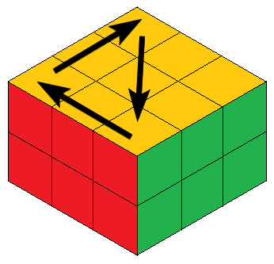
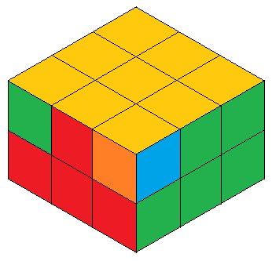

# 3x3x2

## Algoritmos

### Permutación de esquinas

|||
|---|---|
|||

***L - 2D - R - U - R - U’ - R - D’ R - U - R - U’ - R - D’ - L***

## Notación

La notación es la misma de un  [3x3x3](../../Cubos/3x3x3/README.md) obviando las caras centrales, y siendo la cara superior una en la que podemos hacer giros de 90 grados.

En este cubo, ***2(R, L, F, B) === (R, L, F, B)***, ya que son giros de 180 grados.
