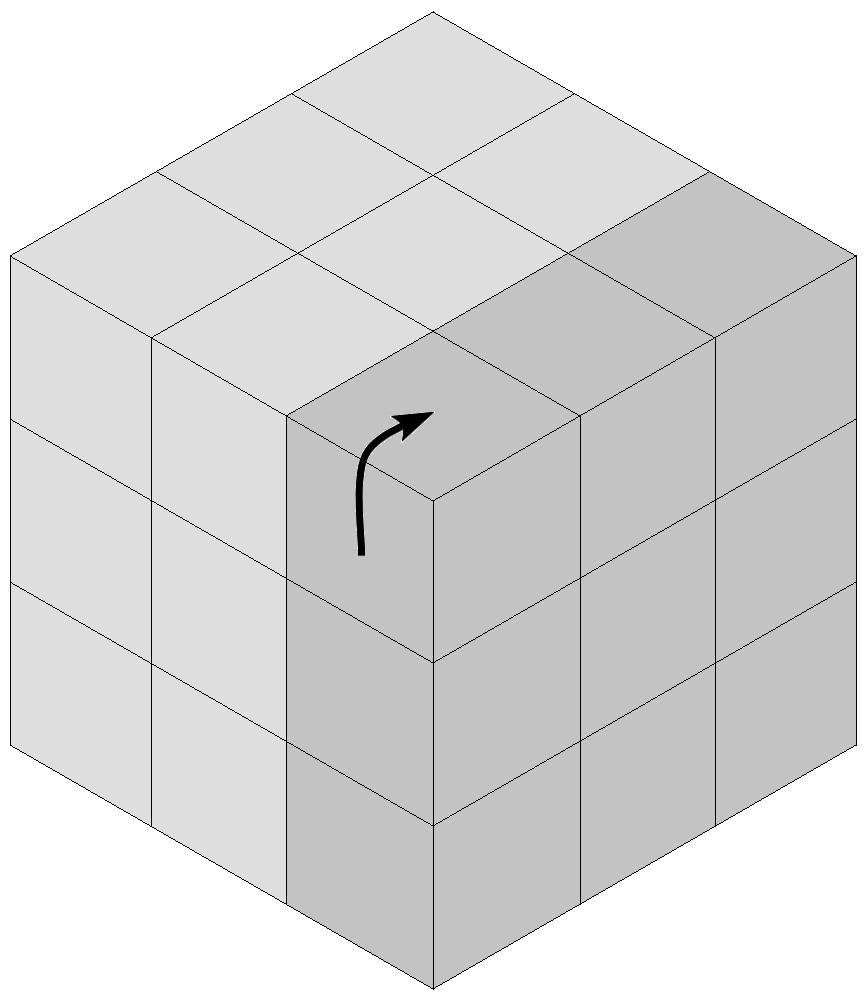
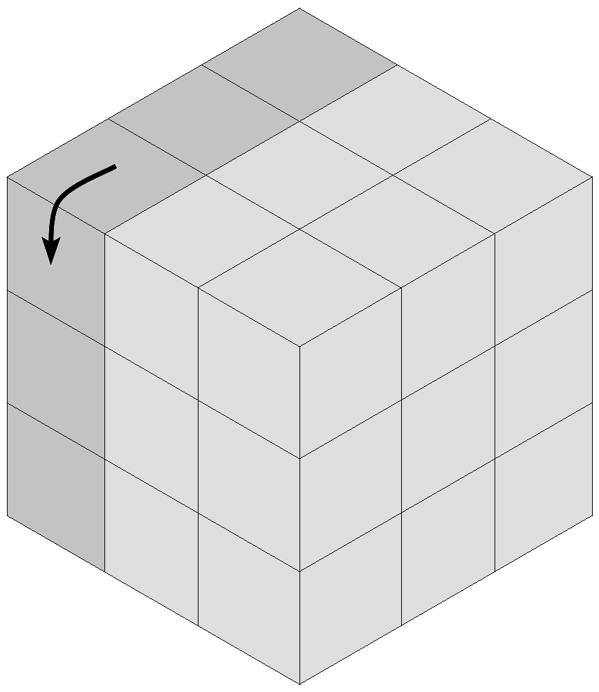
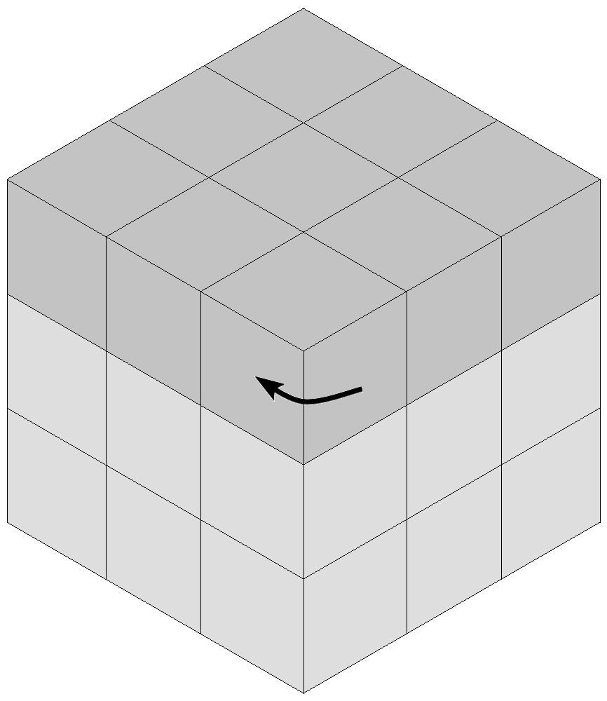
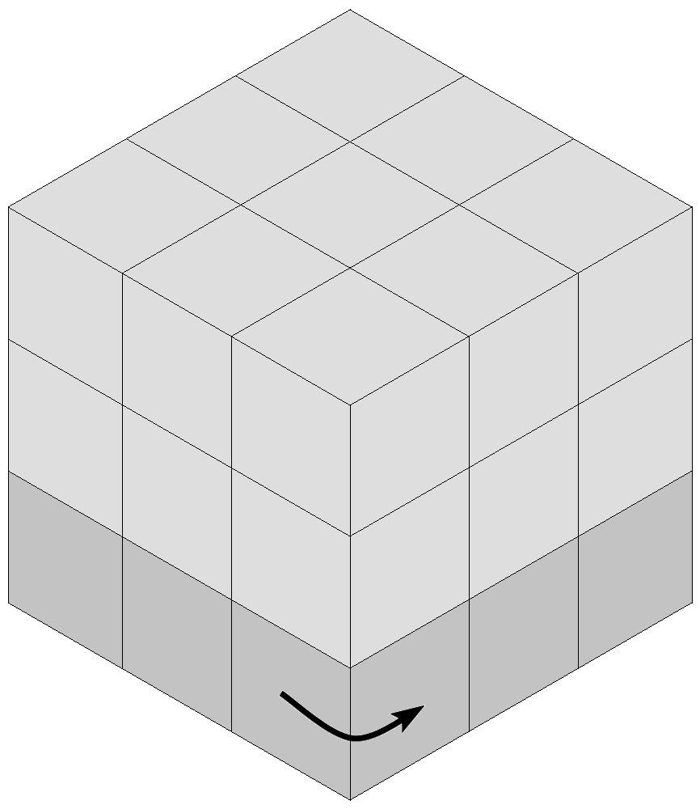
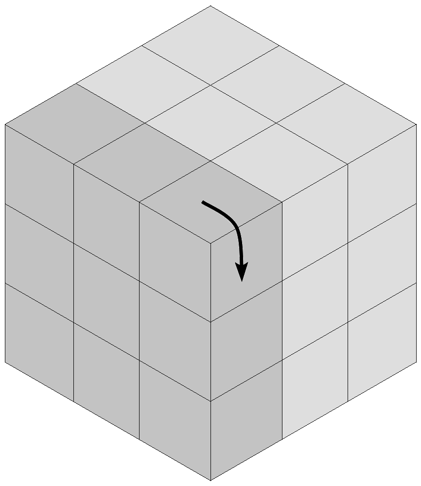
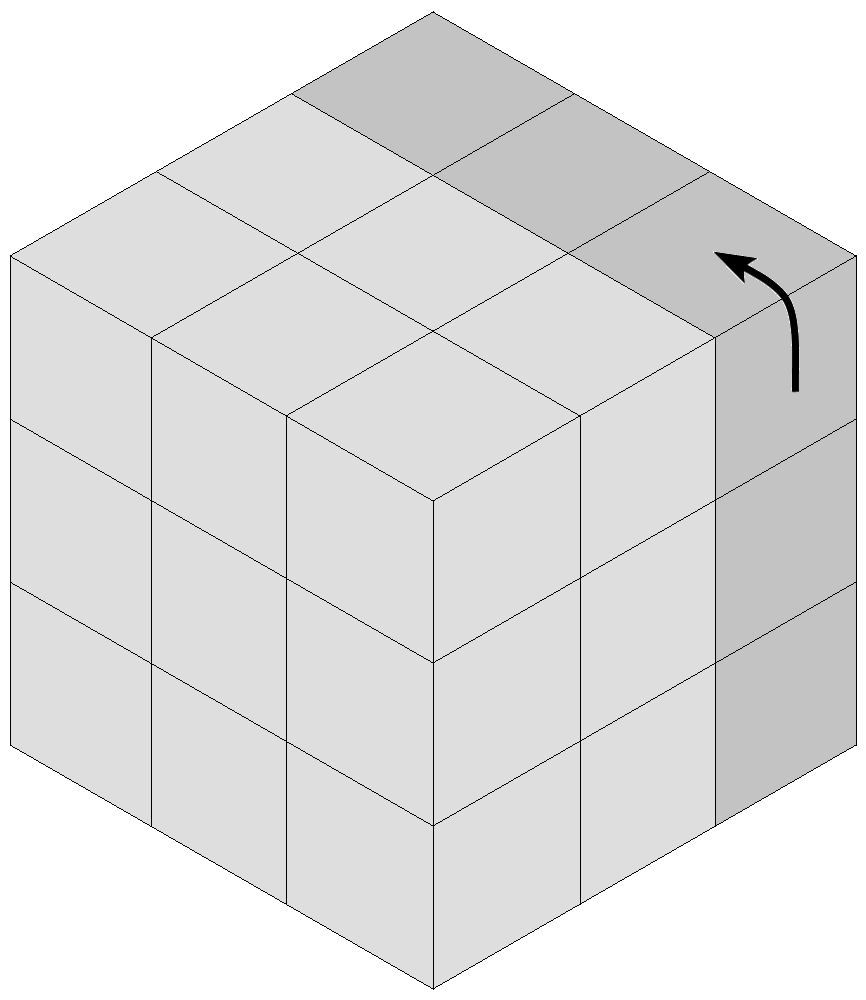
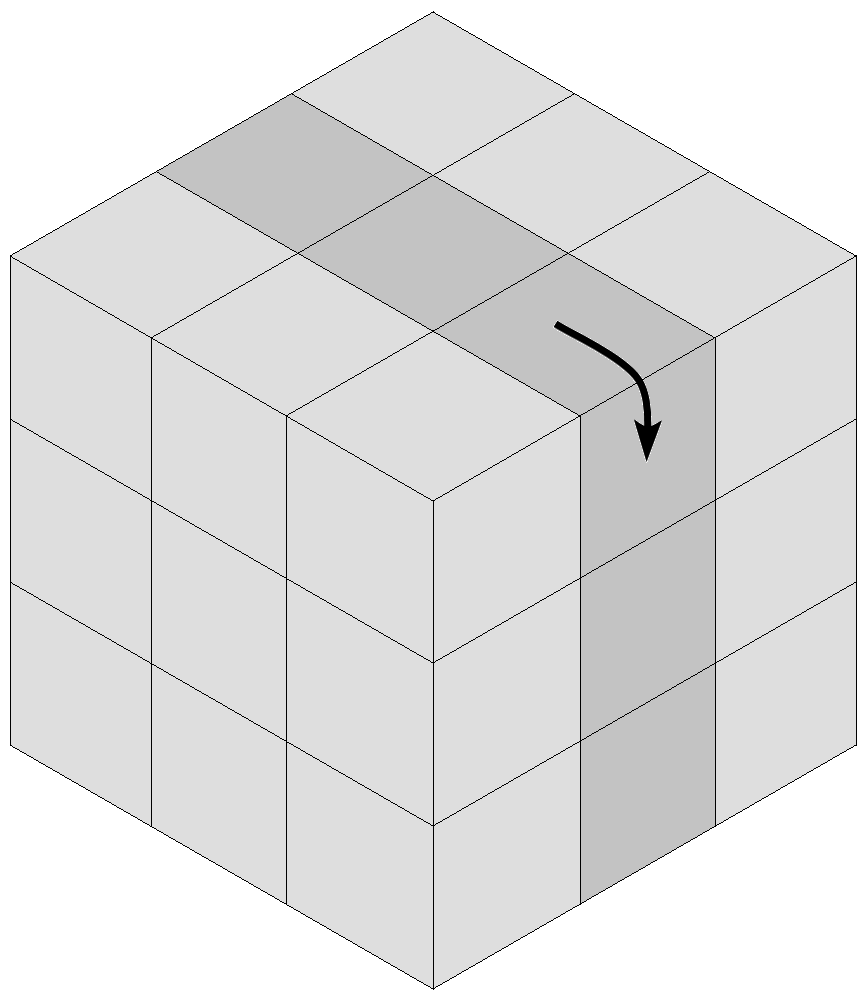
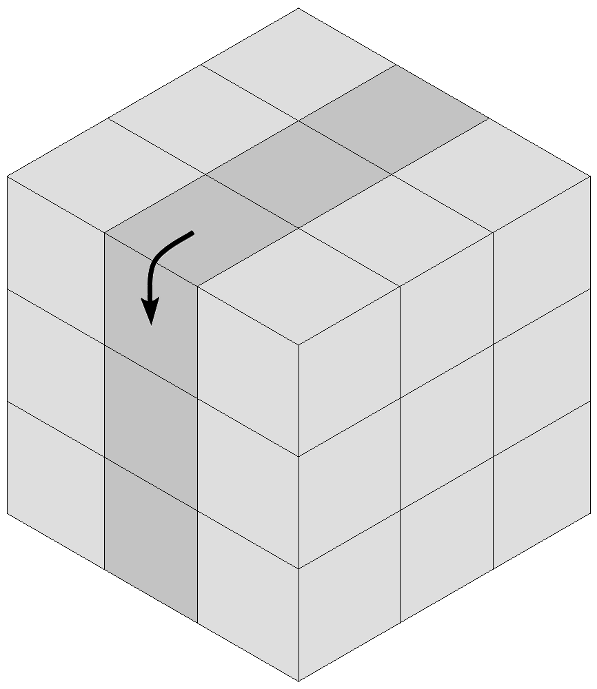
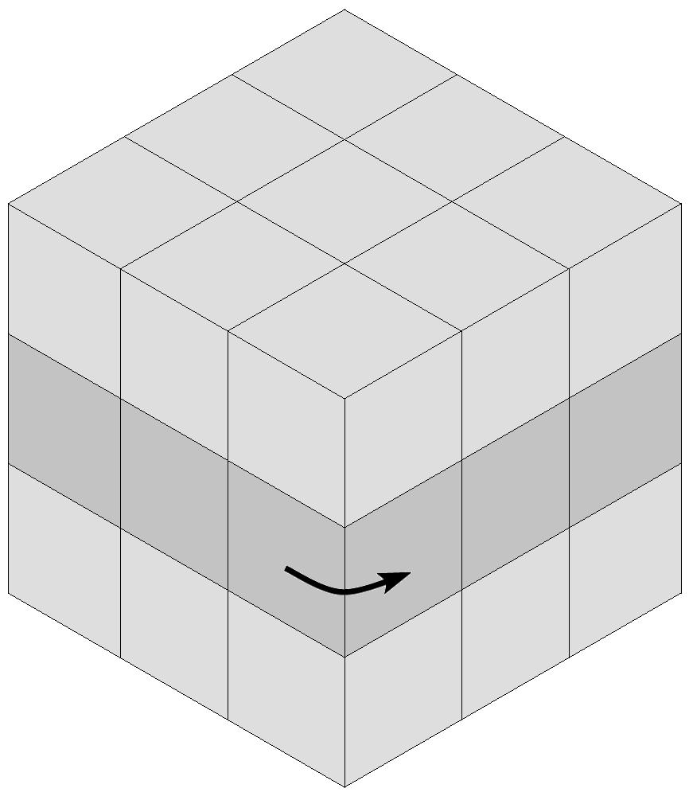

# 3x3x3

## Notación

|||||||
|---|---|---|---|---|---|
|***
R
***|***
L
***|***
U
***|***
D
***|***
F
***|***
B
***|
|***
S
***|***
M
***|***
E
***|

El giro contrario de denota con el caracter `'`. P.E.: ***U'***, ***R'***, etc.  
Para referirnos a dobles giros, especificamos el número de rotaciones. ***2R*** será entonces girar 2 veces la cara ***R***. Por lo tanto ***2(c) === 2(c)'***, y ***3(c) === (c)'***.
