# Helicopter

## Algoritmos

### Permutación de centros

|||
|---|---|
|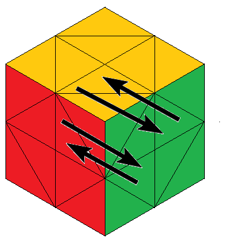|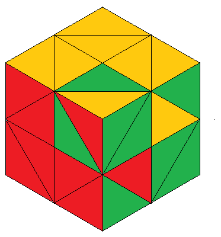|

***FR - UR - FR - UR - FR - UR***  
***3(FR - UR)***

|||
|---|---|
|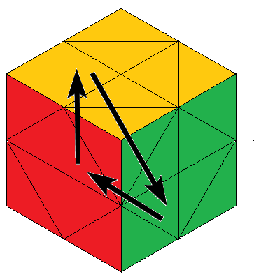|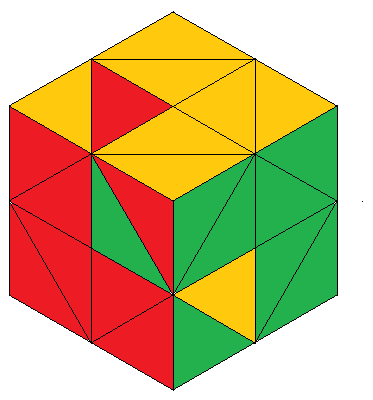|

***FR - UF - FL - UF - FL - UF - FL - FR - UF - FL - UF - FL - UF - FL***  
***FR - 3(UF - FL) - FR - 3(UF - FL)***

## Notación

|||||
|---|---|---|---|
|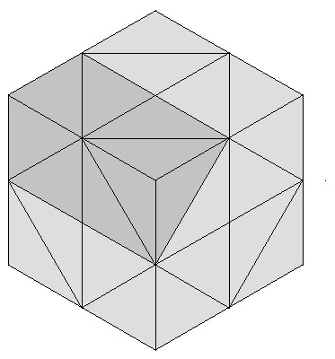***
UF
***|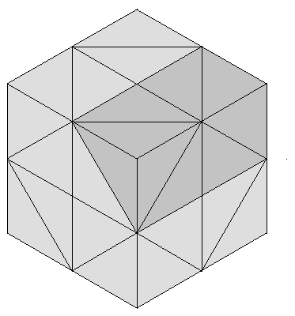***
UR
***|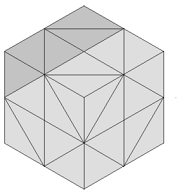***
UL
***|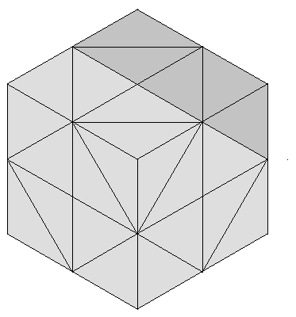***
UB
***|
|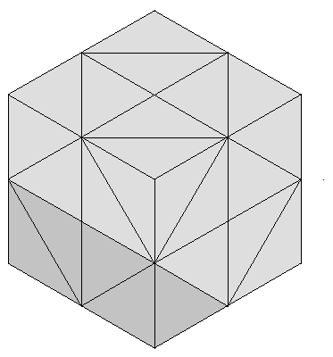***
DF
***|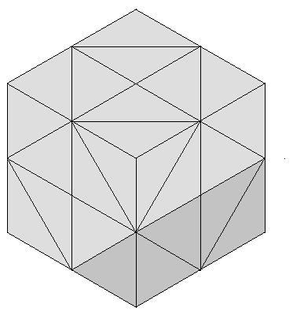***
DR
***|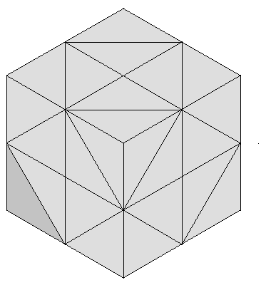***
DL
***|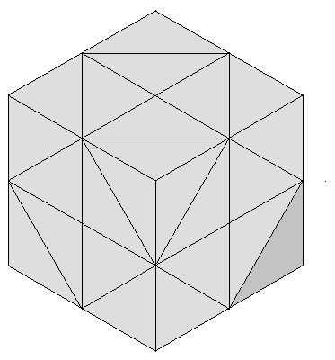***
DB
***|
|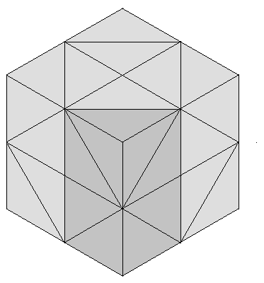***
FR
***|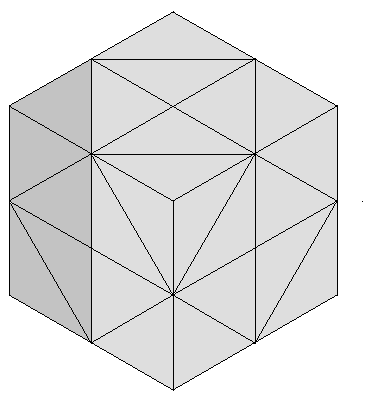***
FL
***|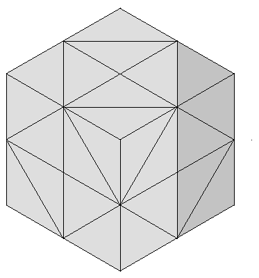***
BR
***|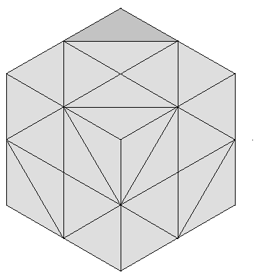***
BL
***|
