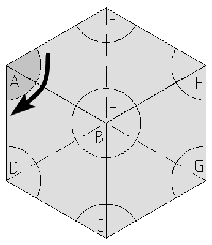

# Skewb

## Notación

Notación estándar de cubos con giro entorno a las esquinas.

|||||
|---|---|---|---|
|***
A
***|***
B
***|***
C
***|***
D
***|
|***
E
***|***
F
***|***
G
***|***
H
***|

El giro contrario de denota con el caracter `'`. P.E.: **A'***, ***B'***, etc.  
Para referirnos a dobles giros, especificamos el número de rotaciones. ***2A*** será entonces girar 2 veces la cara ***A***.
